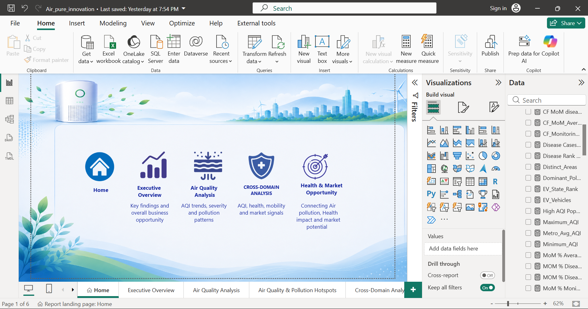
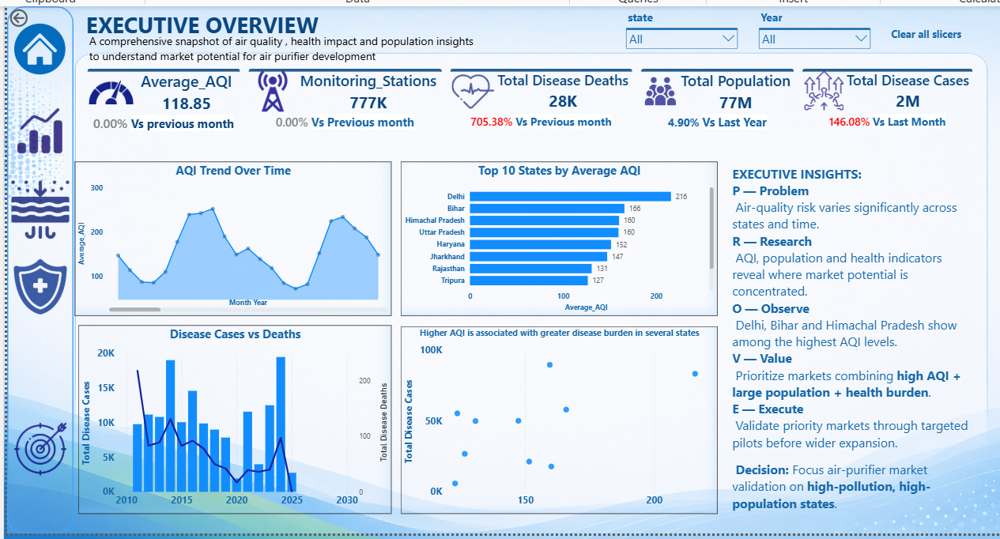
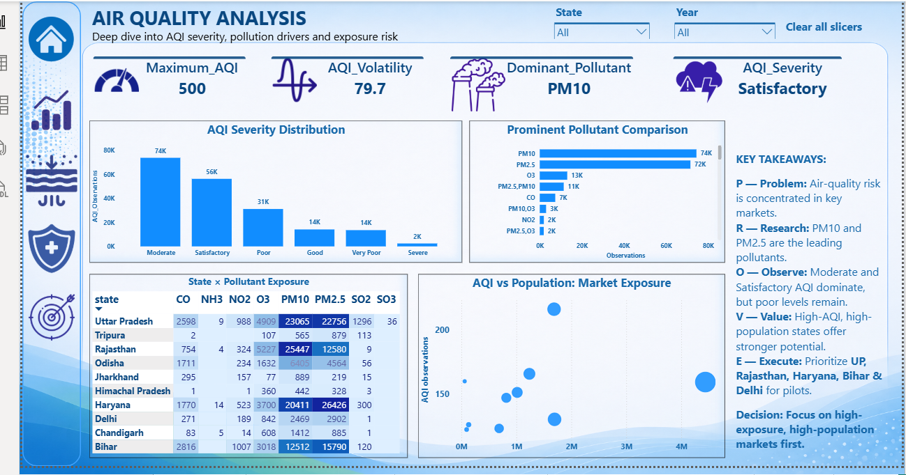
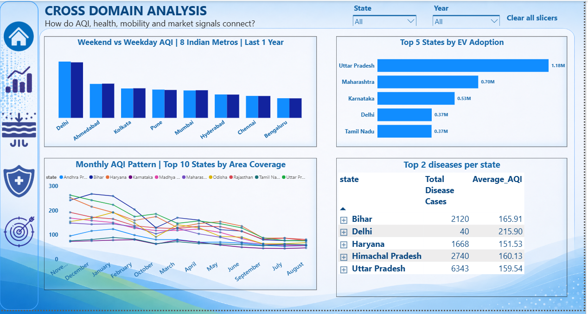
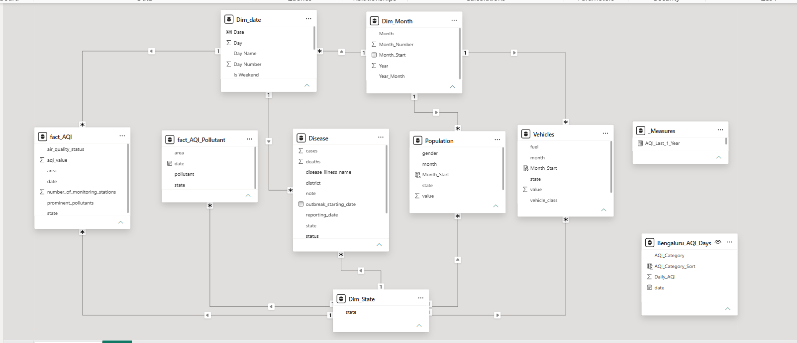

# Air-Purifier-Market-Opportunity-Analysis
An interactive Power BI project connecting air quality, health, population, and market data to identify potential air purifier market opportunities.
#  Air Purifier Market Opportunity Analysis

### Turning Air Quality Data into Business Opportunity Insights

> A business-focused Power BI analytics project connecting
> **air quality, health, population, and vehicle data**
> to identify potential air-purifier market opportunities.

## Project Overview

This is a Power BI business intelligence project focused on a real-world market opportunity — understanding where an air-purifier business could potentially focus its market.

The objective was not simply to create charts, but to approach the data from a business perspective:

- Identify the business problem
- Research the important business signals
- Frame analytical questions
- Analyze multiple datasets
- Identify patterns and relationships
- Translate findings into potential business actions

The project brings together:

- Air Quality
- Pollution
- Health outcomes
- Population
- Vehicle registrations

to understand the relationship between **pollution exposure, health burden, and potential market opportunity**.

##  Business Problem

An air-purifier company entering or expanding in the Indian market needs to understand:

- Where is air pollution most severe?
- Which pollutants are most important?
- Which locations have greater pollution exposure?
- How does air quality vary over time?
- Which areas have significant population exposure?
- What health-related patterns can be observed?
- What additional market signals can help identify potential opportunities?

The key business question is:

> **Where should an air-purifier business investigate its next potential market, and what evidence should support that decision?**

The analysis is designed to help move from a simple pollution question to a broader business perspective:

**Pollution → Health → Population → Market Signals → Business Opportunity**

## 🔍 Business Questions

### Air Quality

- What is the overall AQI pattern?
- Which states and areas have higher AQI?
- How does AQI severity vary across locations?
- Which pollutants are most frequently observed?
- How does AQI change over time?

### Pollution Hotspots

- Which are the top 5 high-AQI areas?
- Which areas have relatively lower AQI?
- Which pollutants are prominent across Southern India?
- What AQI categories are observed in Bengaluru?
- How does AQI vary month by month?
- How does AQI differ between weekdays and weekends across major metros?

### Health

- How do disease cases and deaths vary across states?
- Are higher AQI levels observed alongside higher health burdens?
- Which states show significant health-burden signals?

> The analysis identifies relationships and patterns in the available data. It does not establish that air pollution directly caused the observed health outcomes.

### Market Opportunity

- Which states have greater population exposure?
- Which locations combine pollution exposure with larger populations?
- What does vehicle registration data tell us about market size?
- Where do multiple market signals come together?

##  Tools & Technologies

| Tool | Purpose |
|---|---|
| Power BI Desktop | Dashboard development and visualization |
| Power Query | Data cleaning and transformation |
| DAX | KPI and analytical measure creation |
| Data Modeling | Relationships and analytical structure |
| Excel | Data documentation and supporting analysis |
| GitHub | Project documentation and portfolio management |

## Dashboard Overview

The dashboard is organized into multiple analytical perspectives, supported by a dedicated landing page for navigation.

###  Home Page

Provides navigation across the major analytical sections of the report.

The report follows a simple analytical journey:

**Understand → Analyze → Locate → Connect → Act**

### 1️⃣ Executive Overview

Provides a high-level view of the overall opportunity.

Key analysis includes:

- Average AQI
- Disease cases
- Disease deaths
- Population
- AQI trends
- State-level patterns
- Overall pollution and health signals

The purpose of this page is to help stakeholders quickly understand the **scale and distribution of the opportunity**.

### 2️⃣ Air Quality Analysis

Focuses on understanding the severity and nature of air pollution.

Key analysis includes:

- Average AQI
- AQI severity distribution
- AQI trends
- State-level AQI
- Pollutant comparison
- Pollutant observations
- AQI volatility
- Population exposure

One important finding from the analysis was that **PM10 emerged as the dominant pollutant in the dataset**, while PM10 and PM2.5 had high numbers of observations.

This provides useful context when evaluating potential **air-purifier filtration and product requirements**.

### 3️⃣ Air Quality & Pollution Hotspots

Focuses on identifying locations and periods where pollution levels are higher.

Key analysis includes:

- Top 5 high-AQI areas
- Bottom 5 AQI areas
- Pollutant analysis across Southern India
- Bengaluru AQI category analysis
- Monthly AQI patterns
- Weekday vs weekend AQI
- AQI comparison across major metropolitan cities

The analysis moves beyond simply asking:

> "Where is AQI high?"

and instead investigates:

> **"Where is AQI high, what pollutants are present, and when does the pollution pattern occur?"**

### 4️⃣ Cross-Domain Analysis

Connects air quality with health, population, and mobility-related data.

Key analysis includes:

- AQI vs disease cases
- AQI vs disease deaths
- State-level health burden
- Population exposure
- Vehicle registrations
- EV adoption
- AQI comparison across major states and cities

This page demonstrates how multiple datasets can be connected to provide a broader business perspective rather than analyzing air quality in isolation.

### 5️⃣ Health & Market Opportunity

Brings together multiple signals to understand potential market opportunity.

Key analysis includes:

- Maximum AQI
- AQI volatility
- Dominant pollutant
- AQI severity
- High-AQI population exposure
- Health burden
- Vehicle market size
- EV adoption
- State-level market signals

The key idea is:

> **High pollution alone should not determine market priority.**

A potential market should be evaluated using multiple signals such as:

**Pollution + Population + Health Burden + Market Size**

##  Key Business Insights

### 1. PM10 is a major pollutant signal

PM10 emerged as the dominant pollutant in the dataset.

**Business implication:**

PM10 should be considered when evaluating air-purifier filtration requirements and product positioning.

### 2. Pollution varies significantly by location

AQI levels differ considerably across states and areas.

**Business implication:**

Market research should consider location-specific pollution conditions rather than applying a single nationwide strategy.

### 3. High AQI does not automatically mean high market opportunity

A location may have severe pollution but still require additional market validation.

**Business implication:**

Market prioritization should consider multiple signals:

**AQI + Population + Health Burden + Market Size**

### 4. Health data provides additional context

Disease data shows differences in health burden across states.

**Business implication:**

Health-related indicators can be used as supporting signals when evaluating the potential importance of air-quality problems.

> This analysis shows relationships in the available data and should not be interpreted as proof of direct causation.

### 5. Population exposure matters

AQI needs to be interpreted together with population.

A highly polluted location with a very small population and a moderately polluted location with a much larger population represent different business situations.

**Business implication:**

Population exposure should be considered when evaluating potential market size.

### 6. Vehicle data provides an additional market signal

Vehicle registration data provides another perspective on state-level market size and mobility patterns.

**Business implication:**

Combining environmental data with market-related signals can provide a broader basis for market research.

##  Potential Business Actions

### 1. Investigate high-pollution markets

Identify cities and states with consistently high pollution levels for deeper market research.

### 2. Evaluate product requirements

Use pollutant patterns such as PM10 and PM2.5 as inputs when evaluating filtration and product features.

### 3. Consider population exposure

Prioritize further research in markets where pollution exposure affects a meaningful population.

### 4. Combine multiple market signals

Use AQI, population, health burden, and market-size indicators together rather than relying on a single KPI.

### 5. Validate with real market data

Before making expansion decisions, validate the dashboard findings using:

- Air-purifier sales data
- Competitor pricing
- Customer research
- Search trends
- Household income
- Market penetration
- Product demand
- Actual purchase behavior

### 6. Start with pilot markets

Test demand in selected markets before making larger expansion decisions.

Measure:

- Customer interest
- Conversion
- Sales
- Repeat purchases
- Customer feedback
- Product performance

##  PROVE Framework

I used the **PROVE framework** to keep the project focused on business decision-making rather than only dashboard creation.

### P → Problem

**What business problem are we solving?**

An air-purifier business needs to identify potential markets and understand what pollution-related problems its products should address.

### R → Research

I identified the business signals that could influence the opportunity:

- AQI
- Pollutants
- Health outcomes
- Population
- Vehicle registrations

These signals were then converted into analytical questions.

### O → Observe

The data was analyzed using Power BI, Power Query, and DAX to identify:

- AQI patterns
- Pollution hotspots
- Dominant pollutants
- Health-burden patterns
- Population exposure
- Vehicle and EV patterns

### V → Value

The findings can help a business:

- Identify markets for further investigation
- Understand major pollutant signals
- Evaluate population exposure
- Consider health-related context
- Compare multiple market signals

### E → Execute

The next step would be to validate the findings with real business data.

Potential execution steps include:

1. Shortlist potential markets
2. Conduct customer research
3. Analyze competitors
4. Compare product features and pricing
5. Run pilot-market tests
6. Measure customer response and sales
7. Evaluate results
8. Scale based on validated demand

## 🗂️ Data Sources

The project uses multiple datasets to create a cross-domain analysis.

### Air Quality Dataset

Contains air-quality observations including:

- Date
- State
- Area
- AQI value
- Air quality status
- Prominent pollutants
- Monitoring stations

### Disease Dataset

Contains disease-related information including:

- Year
- State
- District
- Disease / illness
- Cases
- Deaths

### Vehicle Dataset

Contains vehicle-registration information including:

- State
- Fuel type
- Vehicle class
- Registration value
- Month

### Population Dataset

Contains population estimates across states and years.

## 🧹 Data Preparation

Power Query was used to prepare the datasets before analysis.

Key preparation activities included:

- Data type correction
- Column selection
- Handling missing values
- Standardizing fields
- Date transformations
- Creating date dimensions
- Creating month and year attributes
- Preparing analytical fields
- Establishing relationships
- Validating data before visualization

## 🧩 Data Model

The Power BI model connects the major datasets through common dimensions such as:

- Date
- State

The model was designed to support cross-domain analysis across:

**Air Quality → Health → Population → Vehicles**

